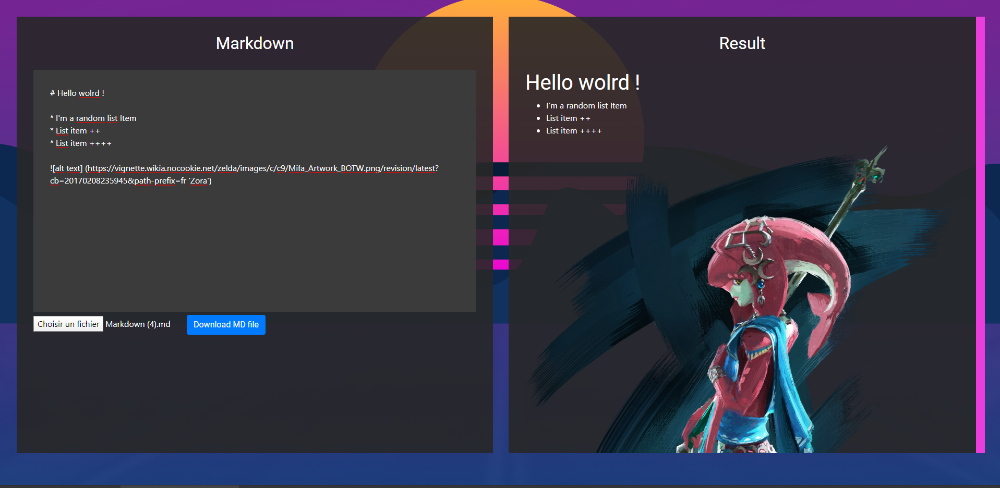

# Markdown-converter

## Project Description:

Markdown-converter is a react based project, made in a simple purpose wich is to learn even more React, I wanted to make a tool to convert my markdown into structured HTML preview, so here is my converter

## How to use it?

Just follow this [link](https://atndesign.github.io/markdown-converter/) .

You can save the md as an .md file
but you also can load a .md file

## Techologies:

#### Languages

- HTML
- CSS
- JS

#### Framework & packages

- SCSS
- ReactJs
- Bootstrap
- Showdown

## Screenshots

## What I learned with that project

- How to use showdown
- How to save a file as a BLOB
- How to load a file with BLOB and fileReader
